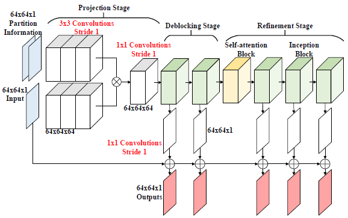
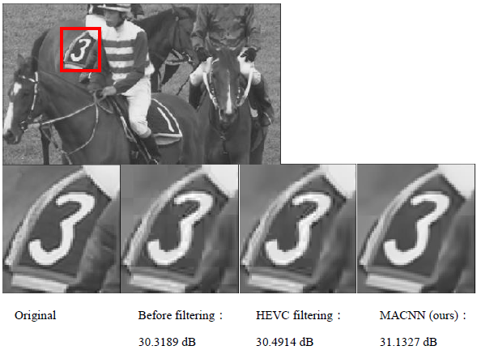

# MACNN_tensorflow
TensorFlow-based implementation of "Multi-stage Attention Convolutional Neural Networks for HEVC In-Loop Filtering" (AICAS 2020)

Use https://nbviewer.jupyter.org to view the Jupyter notebook

# Architecture
The architecture of our MACNN is illustrated below. Green denotes our revised inception block, yellow denotes self-attention block, ⊕ denotes element-wise addition, and ⊗ denotes concatenation.

# Results

# Experiment

python 3.6

TensorFlow 1.11

### Data

CPIH-Intra database proposed by “A Deep Convolutional Neural Network Approach For Complexity Reduction On Intra-Mode Hevc” is adopted.

### Training

The inputs and ground truths are cropped into 64x64 non-overlapping image patches. Only the luminance channel is considered for training, totally 301,248 training examples were used. We use Adam optimizer with β1=0.9, β2=0.999, and ε=10-8 to train our model. The batch size is 16. The hyper-parameter setting is that α=0.3, β=0.3, and λ = {0.15, 0.15, 0.2, 0.25, 0.25}.

### Testing

Experiments are on all test sequences from class B to class E.
